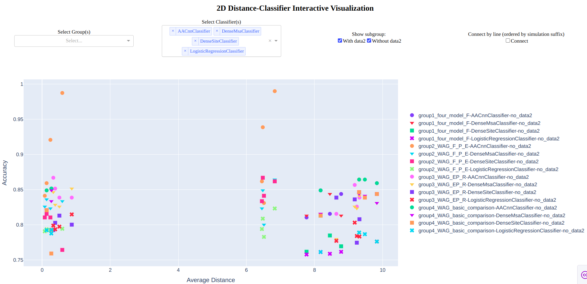

# 2D Distance-Classifier Interactive Visualization



## Overview
This Dash web application provides an interactive visualization for comparing classifier accuracy and average distance across different simulation groups and classifiers. It is designed to help users explore and analyze results from various bioinformatics or machine learning experiments.

## Interface Description
- **Select Group(s):**
  - Dropdown menu to select one or more experimental groups to display on the plot.
- **Select Classifier(s):**
  - Dropdown menu to select which classifiers' results to show (multiple selection supported).
- **Show subgroup:**
  - Checklist to toggle the display of results with or without `data2` in the simulation name.
- **Connect by line (ordered by simulation suffix):**
  - Option to connect points belonging to the same group/classifier by lines, ordered by simulation suffix.
- **Main Plot:**
  - X-axis: Average Distance
  - Y-axis: Accuracy
  - Each point represents a result for a specific group, simulation, and classifier.
  - Different marker shapes and colors represent different classifiers and groups.
  - The legend on the right helps identify each trace.
- **Point Label:**
  - When you click a point, its label will be displayed below the plot.

## How to Use

### 1. Install Requirements
Make sure you have Python 3.7+ and install the required packages:
```bash
pip install -r requirements.txt
```

### 2. Prepare Data
- Place your group results in the directory specified by `GROUP_ROOT` (default: `viridiplantae_group_results`).
- Place your run results in the directory specified by `RUNS_ROOT` (default: `runs_viridiplantae`).
- The directory structure should match the expected format (see code for details).

### 3. Run the App
You can run the app with default directories:
```bash
python app.py
```
Or specify custom data directories using environment variables:
```bash
export GROUP_ROOT="your_group_results_path"
export RUNS_ROOT="your_runs_path"
python app.py
```

### 4. Open in Browser
After starting, open your browser and go to:
```
http://127.0.0.1:8050/
```

### 5. Explore
- Use the dropdowns and checklists to filter and explore your data interactively.
- Click on any point in the plot to see its detailed label below the plot.

## Notes
- If no data appears, check your data directory structure and logs in `app.log` for errors.
- The app is designed to be flexible for different group and classifier configurations.

---
For any questions or issues, please contact the maintainer. 